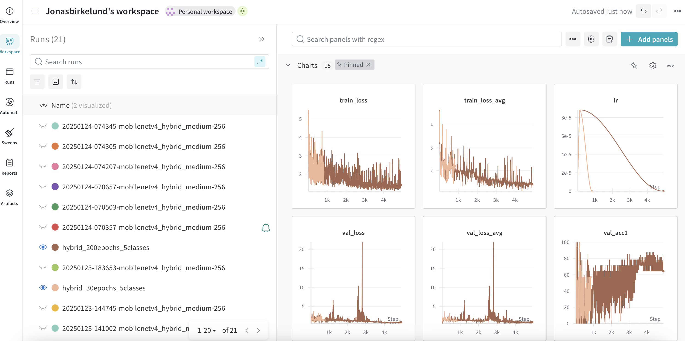
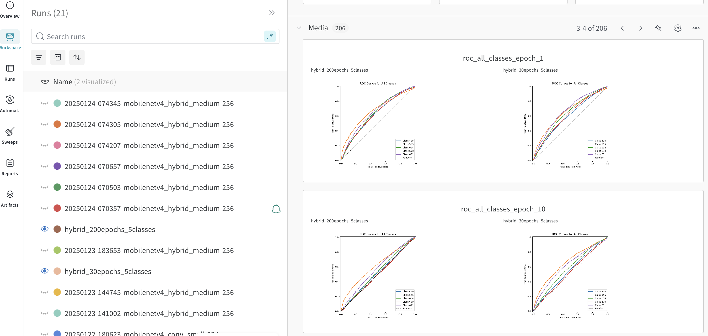

# Exam template for 02476 Machine Learning Operations

This is the report template for the exam. Please only remove the text formatted as with three dashes in front and behind
like:

```--- question 1 fill here ---```

Where you instead should add your answers. Any other changes may have unwanted consequences when your report is
auto-generated at the end of the course. For questions where you are asked to include images, start by adding the image
to the `figures` subfolder (please only use `.png`, `.jpg` or `.jpeg`) and then add the following code in your answer:

```markdown

```

In addition to this markdown file, we also provide the `report.py` script that provides two utility functions:

Running:

```bash
python report.py html
```

Will generate a `.html` page of your report. After the deadline for answering this template, we will auto-scrape
everything in this `reports` folder and then use this utility to generate a `.html` page that will be your serve
as your final hand-in.

Running

```bash
cd reports && python report.py check
```

Will check your answers in this template against the constraints listed for each question e.g. is your answer too
short, too long, or have you included an image when asked. For both functions to work you mustn't rename anything.
The script has two dependencies that can be installed with

```bash
pip install typer markdown
```

## Overall project checklist

The checklist is *exhaustive* which means that it includes everything that you could do on the project included in the
curriculum in this course. Therefore, we do not expect at all that you have checked all boxes at the end of the project.
The parenthesis at the end indicates what module the bullet point is related to. Please be honest in your answers, we
will check the repositories and the code to verify your answers.

### Week 1

* [x] Create a git repository (M5)
* [x] Make sure that all team members have write access to the GitHub repository (M5)
* [x] Create a dedicated environment for you project to keep track of your packages (M2)
* [x] Create the initial file structure using cookiecutter with an appropriate template (M6)
* [x] Fill out the `data.py` file such that it downloads whatever data you need and preprocesses it (if necessary) (M6)
* [x] Add a model to `model.py` and a training procedure to `train.py` and get that running (M6)
* [x] Remember to fill out the `requirements.txt` and `requirements_dev.txt` file with whatever dependencies that you
    are using (M2+M6)
* [x] Remember to comply with good coding practices (`pep8`) while doing the project (M7)
* [x] Do a bit of code typing and remember to document essential parts of your code (M7)
* [x] Setup version control for your data or part of your data (M8)
* [x] Add command line interfaces and project commands to your code where it makes sense (M9)
* [x] Construct one or multiple docker files for your code (M10)
* [x] Build the docker files locally and make sure they work as intended (M10)
* [x] Write one or multiple configurations files for your experiments (M11)
* [ ] Used Hydra to load the configurations and manage your hyperparameters (M11)
* [x] Use profiling to optimize your code (M12)
* [x] Use logging to log important events in your code (M14)
* [x] Use Weights & Biases to log training progress and other important metrics/artifacts in your code (M14)
* [ ] Consider running a hyperparameter optimization sweep (M14)
* [ ] Use PyTorch-lightning (if applicable) to reduce the amount of boilerplate in your code (M15)

### Week 2

* [x] Write unit tests related to the data part of your code (M16)
* [ ] Write unit tests related to model construction and or model training (M16)
* [x] Calculate the code coverage (M16)
* [x] Get some continuous integration running on the GitHub repository (M17)
* [x] Add caching and multi-os/python/pytorch testing to your continuous integration (M17)
* [x] Add a linting step to your continuous integration (M17)
* [x] Add pre-commit hooks to your version control setup (M18)
* [x] Add a continues workflow that triggers when data changes (M19)
* [x] Add a continues workflow that triggers when changes to the model registry is made (M19)
* [x] Create a data storage in GCP Bucket for your data and link this with your data version control setup (M21)
* [x] Create a trigger workflow for automatically building your docker images (M21)
* [x] Get your model training in GCP using either the Engine or Vertex AI (M21)
* [x] Create a FastAPI application that can do inference using your model (M22)
* [x] Deploy your model in GCP using either Functions or Run as the backend (M23)
* [x] Write API tests for your application and setup continues integration for these (M24)
* [x] Load test your application (M24)
* [ ] Create a more specialized ML-deployment API using either ONNX or BentoML, or both (M25)
* [x] Create a frontend for your API (M26)

### Week 3

* [ ] Check how robust your model is towards data drifting (M27)
* [ ] Deploy to the cloud a drift detection API (M27)
* [ ] Instrument your API with a couple of system metrics (M28)
* [ ] Setup cloud monitoring of your instrumented application (M28)
* [x] Create one or more alert systems in GCP to alert you if your app is not behaving correctly (M28)
* [ ] If applicable, optimize the performance of your data loading using distributed data loading (M29)
* [ ] If applicable, optimize the performance of your training pipeline by using distributed training (M30)
* [x] Play around with quantization, compilation and pruning for you trained models to increase inference speed (M31)

### Extra

* [x] Write some documentation for your application (M32)
* [ ] Publish the documentation to GitHub Pages (M32)
* [x] Revisit your initial project description. Did the project turn out as you wanted?
* [x] Create an architectural diagram over your MLOps pipeline
* [x] Make sure all group members have an understanding about all parts of the project
* [x] Uploaded all your code to GitHub

## Group information

### Question 1
> **Enter the group number you signed up on <learn.inside.dtu.dk>**
>
> Answer:

12

### Question 2
> **Enter the study number for each member in the group**
>
> Example:
>
> *sXXXXXX, sXXXXXX, sXXXXXX*
>
> Answer:

s233489, jonnil, s091969, s233480

### Question 3
> **A requirement to the project is that you include a third-party package not covered in the course. What framework**
> **did you choose to work with and did it help you complete the project?**
>
> Recommended answer length: 100-200 words.
>
> Example:
> *We used the third-party framework ... in our project. We used functionality ... and functionality ... from the*
> *package to do ... and ... in our project*.
>
> Answer:

The third-party framework [TIMM (PyTorch Image Models) from Huggingface](https://github.com/huggingface/pytorch-image-models) was used in our project. We used functionality from the package to access a wide variety of models and the ImageNet-1k dataset. By doing this, we could quickly experiment with different architectures, sizes and finetune a image classification model for our specific task.

As a starting point, we used a pre-made `train.py` script from the TIMM codebase, which provides a very high level of parameter customization either through command-line arguments or via a configuration YAML-file specifying the desired parameters. This script was modified with additional functionality related to our MLOps pipeline. As an example, an option to automatically detect the number of classes in the input data was added, such that a change in the input data would automatically be handled in the model construction. Furthermore, we extended the script's logging functionality by adding additional logging of information to Weights & Biases, both related to the model configuration parameters and training metrics.

## Coding environment

> In the following section we are interested in learning more about you local development environment. This includes
> how you managed dependencies, the structure of your code and how you managed code quality.

### Question 4

> **Explain how you managed dependencies in your project? Explain the process a new team member would have to go**
> **through to get an exact copy of your environment.**
>
> Recommended answer length: 100-200 words
>
> Example:
> *We used ... for managing our dependencies. The list of dependencies was auto-generated using ... . To get a*
> *complete copy of our development environment, one would have to run the following commands*
>
> Answer:

The `pip` package manager was used for managing our dependencies. The list of dependencies was manually maintained in the `requirements.txt` and `requirements_dev.txt` files as well as the `requirements` files in the `deps` folder. Requirements in the `deps` folder are specific dependencies used when containerizing our applications.

Assuming that Python 3.12 and `pip` are installed, a complete copy of our development environment can be obtained by cloning the repository and running the following commands. This creates a new virtual environment in Python, activates it and installs dependencies using `pip` installer:

```bash
python -m venv venv
source venv/bin/activate  # On Windows use `venv\Scripts\activate`
pip install -r requirements.txt
pip install -r requirements_dev.txt
pip install -r deps/requirements_data.txt
pip install -r deps/requirements_model.txt
pip install -r deps/requirements_train.txt
```

This will ensure that all packages used in the whole project in their specific versions are installed, hereby replicating the exact environment. Note, that currently sub-dependencies are not locked in the requirement files.

Another option is `conda`. We provide and `invoke` task for creating a virtual environment using `conda`.
To do so, simply run:

```bash
invoke create-environment
```

This creates the virtual environment `dtu_mlops_project`. Activate it using `conda activate dtu_mlops_project` and install dependencies with `pip` as described above.

### Question 5

> **We expect that you initialized your project using the cookiecutter template. Explain the overall structure of your**
> **code. What did you fill out? Did you deviate from the template in some way?**
>
> Recommended answer length: 100-200 words
>
> Example:
> *From the cookiecutter template we have filled out the ... , ... and ... folder. We have removed the ... folder*
> *because we did not use any ... in our project. We have added an ... folder that contains ... for running our*
> *experiments.*
>
> Answer:

Using the cookiecutter template from the [template repository](https://github.com/SkafteNicki/mlops_template), we have
filled out the `src`, `data`, `configs`, `dockerfiles`, and `tests` folders specific to our project. We have removed the `notebook` and `models` folder as we did not use Jupyter Notebooks in our project and our models were stored at Weights & Biases Model Registry. Additionally, we have added GitHub workflows in `.github/workflows` for our CI/CD (continuous integration and continuous development) for building and deploying our project to cloud, data version control in `.dvc` folder, and a specific `deps` folder containing dependencies for specific code in the `src` directory used in our dockerfiles.

The main directories include `src`, `data`, `tests`, `configs`, and `.github/workflows`. The `src` directory contains the core codebase, including scripts for data processing, model training, and inference. The `data` directory is used for data storage and management, while the `tests` directory holds all unit and integration tests to ensure code quality and functionality.

### Question 6

> **Did you implement any rules for code quality and format? What about typing and documentation? Additionally,**
> **explain with your own words why these concepts matters in larger projects.**
>
> Recommended answer length: 100-200 words.
>
> Example:
> *We used ... for linting and ... for formatting. We also used ... for typing and ... for documentation. These*
> *concepts are important in larger projects because ... . For example, typing ...*
>
> Answer:

We used `ruff` for checking our code quality and format. `ruff` was used for both linting and formatting our source codebase, which was run as a workflow for each pull request with GitHub Actions. GitHub Action Bot was in charge of automatically applying the changes and commiting it to the pull request. Specific rules in `ruff` were adapted from `isort`, `Pyflake`, and `Pyupgrade`.

Practices implementing code quality and format are crucial in larger projects as they help enhance code consistency and readability. Furthermore, it can help to keep compliance with specific style guides like `PEP 8` for large codebases. This can make it easier for team members to understand and contribute to larger projects where it can be hard to maintain good code quality.

## Version control

> In the following section we are interested in how version control was used in your project during development to
> corporate and increase the quality of your code.

### Question 7

> **How many tests did you implement and what are they testing in your code?**
>
> Recommended answer length: 50-100 words.
>
> Example:
> *In total we have implemented X tests. Primarily we are testing ... and ... as these the most critical parts of our*
> *application but also ... .*
>
> Answer:

In our project, we have implemented 12 automated tests in total, including performance tests with `locust` together with unit tests and integration test executed with `pytest`. We have primarily been testing our API service `api.py` with performance tests (loadtesting) and integration tests as this is the most critical service in our project's backend.

The implemented unit tests are for `data.py` and `train.py`. These tests ensure that the data preprocessing and model training functions work as expected.

### Question 8

> **What is the total code coverage (in percentage) of your code? If your code had a code coverage of 100% (or close**
> **to), would you still trust it to be error free? Explain you reasoning.**
>
> Recommended answer length: 100-200 words.
>
> Example:
> *The total code coverage of code is X%, which includes all our source code. We are far from 100% coverage of our **
> *code and even if we were then...*
>
> Answer:

From our GitHub Actions CI pipeline, we can inspect our code coverage results:


Our codebase has a total code coverage of 39% which includes the most essential code in our project. Data unit test has a coverage of 42% and the train unit test has a coverage of 39%. This indicates that more than half of our code is not covered by any tests.

The API integration test has a coverage on 77%. Note, that this is an integration test and the purpose is to test the functionality of the interface as a whole, because we're dealing with I/O. So, it is difficult to test in isolation, which would require a sophisticated mocking framework, but that would ruin the purpose and turn it into a white box test.

We are far away from 100% coverage so it is clear that our test strategy is insufficient. On the other hand, even if we got 100% code coverage, our test strategy would not be guaranteed error-free as we can only verify the presence of known issues, not the absence of unknown ones.

### Question 9

> **Did you workflow include using branches and pull requests? If yes, explain how. If not, explain how branches and**
> **pull request can help improve version control.**
>
> Recommended answer length: 100-200 words.
>
> Example:
> *We made use of both branches and PRs in our project. In our group, each member had an branch that they worked on in*
> *addition to the main branch. To merge code we ...*
>
> Answer:

We made use of both branches and PRs in our project. Each group member had to checkout a new branch when working on features that they wanted to contribute to the GitHub repository. We only allowed changes on main branch for documentational changes (markdown-files) and the group was instructed to not develop any code on the main-branch. To merge a feature branch into main, each team member have to create pull requests (PRs) which were code reviewed by at least one other team member before merging. This way of working helped the group to ensure code quality and enhanced collaboration and discussion of changes.

Branches and PRs helped our group keeping version control by isolating new features into specific branches. This helped us also to ensure code quality as all PRs were checked using `ruff` and verified by running a test suite with `pytest` of all implemented tests in the `tests` folder.

### Question 10

> **Did you use DVC for managing data in your project? If yes, then how did it improve your project to have version**
> **control of your data. If no, explain a case where it would be beneficial to have version control of your data.**
>
> Recommended answer length: 100-200 words.
>
> Example:
> *We did make use of DVC in the following way: ... . In the end it helped us in ... for controlling ... part of our*
> *pipeline*
>
> Answer:

DVC was used in the project to ensure version control of our [training](figures/data_samples_train.png) and [validation](figures/data_samples_validation.png) datasets, based on a subset of the ImageNet-1K dataset. Integrating GCP buckets with object versioning and DVC let us combine both cloud storage and version control, resulting in enhanced protection against accidental deletions or modifications. Two primary dataset versions were created, with the first version consisting of 3 ImageNet class IDs (654, 436, 555), and the second version being expanded with two additional classes (671, 670), resulting in 6,760 items totaling 367 MB. DVC checkout allowed us to easily retrieve specific versions of tracked data, enabling quick experimentation and debugging.

A GitHub Action is created that triggers the [MLOps training pipeline](https://github.com/DTU-MLOPS-12/dtu_mlops_project/actions/workflows/data_version_control.yml) when a GitHub pull request includes a data version change. In the training pipeline the dataset is downloaded during the Docker build process, making it ready for training when the Docker container is deployed to more expensive GPU servers for model training using Vertex AI custom-jobs.

### Question 11

> **Discuss you continuous integration setup. What kind of continuous integration are you running (unittesting,**
> **linting, etc.)? Do you test multiple operating systems, Python  version etc. Do you make use of caching? Feel free**
> **to insert a link to one of your GitHub actions workflow.**
>
> Recommended answer length: 200-300 words.
>
> Example:
> *We have organized our continuous integration into 3 separate files: one for doing ..., one for running ... testing*
> *and one for running ... . In particular for our ..., we used ... .An example of a triggered workflow can be seen*
> *here: <weblink>*
>
> Answer:

Our group has organized our continuous integration into separate workflows: one for linting and formatting code, one for running the test suite including unit test cases, and three workflows as a part of the continuous building and deployment.

For the code check workflow we used `ruff` to check for code quality and formatting issues automatically with GitHub Actions bot which is triggered on every pull request or workflow dispatch. An example of a triggered workflow through a pull request can be seen [here](https://github.com/DTU-MLOPS-12/dtu_mlops_project/actions/runs/12905630833/job/35985228785).

The test suite is part of a seperate workflow which runs our unit tests and integration tests in the `tests` folder using the `pytest` framework. This workflow is also triggered on every pull request when the changes in the pull request include updates to python files. By using a matrix in our workflow file we ran the test suite on multiple operating systems in parallel (mac-os and ubuntu) which enhanced the reliability of our testing by ensuring compatibility across operating systems. An example of a triggered workflow can be seen [here](https://github.com/DTU-MLOPS-12/dtu_mlops_project/actions/runs/12909923637).

We also made use of caching in our GitHub workflows to speed up the installation of dependencies and reduce build times. By caching the dependencies, we could avoid downloading and installing the same packages repeatedly, saving us time when executing workflows.

## Running code and tracking experiments

> In the following section we are interested in learning more about the experimental setup for running your code and
> especially the reproducibility of your experiments.

### Question 12

> **How did you configure experiments? Did you make use of config files? Explain with coding examples of how you would**
> **run a experiment.**
>
> Recommended answer length: 50-100 words.
>
> Example:
> *We used a simple argparser, that worked in the following way: Python  my_script.py --lr 1e-3 --batch_size 25*
>
> Answer:

We used config files for training our models to ensure reproducibility. These config files were adapted from the ones provided by Ross Wightman, the creator of the TIMM library (found [here](https://gist.github.com/rwightman/f6705cb65c03daeebca8aa129b1b94ad)).

As an example, a config file can be provided to our training script as follows:
```bash
python3 src/dtu_mlops_project/train.py --config configs/mobilenetv4_conv_small_fine_tuning.yaml
```

This command will execute the training process using the specified configuration file ensuring parameters are applied.

### Question 13

> **Reproducibility of experiments are important. Related to the last question, how did you secure that no information**
> **is lost when running experiments and that your experiments are reproducible?**
>
> Recommended answer length: 100-200 words.
>
> Example:
> *We made use of config files. Whenever an experiment is run the following happens: ... . To reproduce an experiment*
> *one would have to do ...*
>
> Answer:

We ensured the reproducibility of our experiments by using configuration files and logging all relevant information. A successful training run of a TIMM model outputs to a directory a set files containing:

* The config file
* Training run statistics per epoch (loss, accuracy etc.)
* The final output model

Given this, any experiment could be reproduced by re-running the training with a given config file. Furthermore, by logging the model training in Weights & Biases, we could access any previous model and its configuration. This logging includes metrics, metadata and artifacts, which ensures that we can trace back and reproduce any experiment.

To reproduce an experiment, one would have to:

1. Retrieve the relevant configuration file.
2. Use the configuration file to re-run the training script.
3. Compare the new training logs with the old training logs stored in Weights & Biases.


### Question 14

> **Upload 1 to 3 screenshots that show the experiments that you have done in W&B (or another experiment tracking**
> **service of your choice). This may include loss graphs, logged images, hyperparameter sweeps etc. You can take**
> **inspiration from [this figure](figures/wandb.png). Explain what metrics you are tracking and why they are**
> **important.**
>
> Recommended answer length: 200-300 words + 1 to 3 screenshots.
>
> Example:
> *As seen in the first image when have tracked ... and ... which both inform us about ... in our experiments.*
> *As seen in the second image we are also tracking ... and ...*
>
> Answer:

For all our experiments, we tracked several metrics related to the model training. These include:

* **Training and Validation Loss/Accuracy Curves**: These indicate if the model is learning from the data. They are also essential for diagnosing issues such as overfitting or underfitting. Additionally, these curves can also be useful for tuning hyperparameters such as the learning rate, as too high learning rates will often lead to noisy loss curves getting stuck in local minima.

* **Histogram of Model Gradients**: This metric is useful for identifying issues such as vanishing gradients, which can impede the model's learning process. By logging the distribution of gradients, we can ensure that the model is learning effectively.

* **ROC (Receiver Operating Characteristic) Curves**: ROC curves show how well the model is able to classify positive and negative examples. We opted to log a ROC curve for each training epoch that shows the per-class performance. This can help to understand the model's performance across different classes and identifying any potential issues.

Below we have shown two screenshots of experiments in W&B. The two experiments highlighted are two training runs done with different number of epochs (30 vs 200). The first screenshot shows some loss and accuracy curves along with other metrics logged during training (e.g. learning rate), while the second shows the ROC curves for a subset of epochs.




### Question 15

> **Docker is an important tool for creating containerized applications. Explain how you used docker in your**
> **experiments/project? Include how you would run your docker images and include a link to one of your docker files.**
>
> Recommended answer length: 100-200 words.
>
> Example:
> *For our project we developed several images: one for training, inference and deployment. For example to run the*
> *training docker image: `docker run trainer:latest lr=1e-3 batch_size=64`. Link to docker file: <weblink>*
>
> Answer:

In this project, we developed several docker images that was build to containerize our applications into Google Cloud:

* **Data Container**: A Dockerfile for building and running a container for data collection and data preparation of the ImageNet-1k dataset.
* **Training Container**: A Dockerfile for building and running a container for the training script for fine-tuning the MobileNet-V4 models.
* **Backend Container**: A Dockerfile for building and running a container for the backend application utilizing the FastAPI framework.
* **Frontend Container**: A Dockerfile for building and running a container for the frontend application utilizing the Streamlit framework.

The Docker images of applications were ran with either Vertex AI or Cloud Run after they had been built and uploaded to the artifact registry on Google Cloud Platform.

For example, a local run of the training script docker image with 5 epochs could be leveraged with this command:
```bash
docker run train:latest --config configs/mobilenetv4_conv_small_fine_tuning.yaml --epochs=5 --wandb-project=mlops_dtu
```

To run the backend (api) and frontend container locally, the following commands can be used:
```bash
docker run api:latest
```
```bash
docker run frontend:latest
```

The link to the training dockerfile can be found [here.](https://github.com/DTU-MLOPS-12/dtu_mlops_project/blob/main/dockerfiles/train.dockerfile)

### Question 16

> **When running into bugs while trying to run your experiments, how did you perform debugging? Additionally, did you**
> **try to profile your code or do you think it is already perfect?**
>
> Recommended answer length: 100-200 words.
>
> Example:
> *Debugging method was dependent on group member. Some just used ... and others used ... . We did a single profiling*
> *run of our main code at some point that showed ...*
>
> Answer:

The group's debugging methods varied among group members. Print statements were used to quickly trace the flow of the code and identify issues. Some members used more advanced tools like interactive debugging sessions (run and debug) in Visual Studio Code, while others used the Python debugger `pdb`. Additionally, we used propper logging to capture detailed information about the execution of our code when running our training script in Google Cloud. The idea was that it could help us to diagnose issues and monitoring the state of the program while running.

Our group didn't do profiling using `cProfile` or PyTorch profiling to identify performance bottlenecks in our code. We believe that our code could benefit from profiling to identify potential bottlenecks and optimize performance. It could have been useful for us especially to optimize the training pipeline and to ensure that our inference processes are as efficient as possible.


## Working in the cloud

> In the following section we would like to know more about your experience when developing in the cloud.

### Question 17

> **List all the GCP services that you made use of in your project and shortly explain what each service does?**
>
> Recommended answer length: 50-200 words.
>
> Example:
> *We used the following two services: Engine and Bucket. Engine is used for... and Bucket is used for...*
>
> Answer:

We used the following GCP services in our project:

1. Compute Engine: Used for running virtual machines to handle various machine learning training tasks.
2. Cloud Storage: Utilized for storing datasets combined with DVC for version control.
3. Artifact Registry: Used for storing and managing Docker images.
4. Vertex AI: Leveraged for the training pipeline using an `ai custom-jobs` command with an Nvidia V100 GPU.
5. Cloud Run: Deployed our containerized applications for scalable and managed serverless execution of e.g. frontend and backend utilizing Streamlit and FastAPI.
6. Cloud Monitoring: Implemented to monitor the performance and health of our deployed applications.

### Question 18

> **The backbone of GCP is the Compute engine. Explained how you made use of this service and what type of VMs**
> **you used?**
>
> Recommended answer length: 100-200 words.
>
> Example:
> *We used the compute engine to run our ... . We used instances with the following hardware: ... and we started the*
> *using a custom container: ...*
>
> Answer:

We first tried out Compute Engine to run our training and inference task. We started running on CPU with machine type `n1-standard-1` until we had the option to accelerate our Compute Engine with a GPU. A new VM was deployed utilizing GPU instances with 1x NVIDIA Tesla P4. When running jobs we always tracked the metrics for the CPU and GPU, and we could see that the CPU was utilized to its full capacity during training. After deploying a GPU-accelerated VM this significantly reduced the training time compared to using only CPU instances.

We eventually changed from training the model in Compute Engine VMs to training it in Vertex AI custom jobs as this benefits us by providing an easier runs for our training jobs. Vertex AI custom jobs allow us to more easily configure and run training jobs with the necessary resources, such as GPUs, without the need to manually manage the underlying infrastructure as in Compute Engine. This also simplifies the process of scaling up or down based on the computational requirements of our training tasks as we do not have to start and stop our VMs.

### Question 19

> **Insert 1-2 images of your GCP bucket, such that we can see what data you have stored in it.**
> **You can take inspiration from [this figure](figures/bucket.png).**
>
> Answer:


### Question 20

> **Upload 1-2 images of your GCP artifact registry, such that we can see the different docker images that you have**
> **stored. You can take inspiration from [this figure](figures/registry.png).**
>
> Answer:


### Question 21

> **Upload 1-2 images of your GCP cloud build history, so we can see the history of the images that have been build in**
> **your project. You can take inspiration from [this figure](figures/build.png).**
>
> Answer:

Instead of using Cloud Build in GCP, we utilized only GitHub Actions for building our Docker images and other task in our CI/CD pipeline. Below is a screenshot of our GitHub Actions workflows history of successful builds on main branch:


### Question 22

> **Did you manage to train your model in the cloud using either the Engine or Vertex AI? If yes, explain how you did**
> **it. If not, describe why.**
>
> Recommended answer length: 100-200 words.
>
> Example:
> *We managed to train our model in the cloud using the Engine. We did this by ... . The reason we choose the Engine*
> *was because ...*
>
> Answer:

We managed to train our model in the cloud using Vertex AI. We did this by setting up a [GitHub Actions training workflow](https://github.com/DTU-MLOPS-12/dtu_mlops_project/actions/workflows/data_version_control.yml) that automates the process of building and pushing our Docker image to Google Artifact Registry, and then starting a custom training job on Vertex AI utilizing an Nvidia V100 GPU.

First, we created a Dockerfile to containerize our training script. We then configured a GitHub Actions workflow to authenticate with Google Cloud using service account credentials stored in GitHub Secrets. The workflow builds the Docker image, pushes it to the Artifact Registry, and makes a custom job in Vertex UI with a `gcloud` create command to start the training job on Vertex AI.

We chose Vertex AI because it provides a managed environment for training machine learning models, which simplifies the process of scaling and managing resources.

## Deployment

### Question 23

> **Did you manage to write an API for your model? If yes, explain how you did it and if you did anything special. If**
> **not, explain how you would do it.**
>
> Recommended answer length: 100-200 words.
>
> Example:
> *We did manage to write an API for our model. We used FastAPI to do this. We did this by ... . We also added ...*
> *to the API to make it more ...*
>
> Answer:

We implemented a minimal usable REST API using the `fastapi` framework. Our API exposes a few different endpoints:

- `/`: Root endpoint, merely for health-checks.
- `/about/`: A small 'about'-endpoint with information about the model currently in use and the repository for the service code.
- `/api/predict/`: The most important endpoint, which accepts an image file and provides inference using the current production model.
- `/api/predict/preproduction/`: Similar to the `/api/predict/`-endpoint, except that this uses the tagged `preprod`-model from W&B. This is intended for pre-release quality control for new models.
- `/api/predict/dummy/`: Similar to the `/api/predict/`-endpoint, except that a dummy model (pre-trained `mobilenetv4` from `timm`) is used for inference. This is primarily used for testing purposes.

### Question 24

> **Did you manage to deploy your API, either in locally or cloud? If not, describe why. If yes, describe how and**
> **preferably how you invoke your deployed service?**
>
> Recommended answer length: 100-200 words.
>
> Example:
> *For deployment we wrapped our model into application using ... . We first tried locally serving the model, which*
> *worked. Afterwards we deployed it in the cloud, using ... . To invoke the service an user would call*
> *`curl -X POST -F "file=@file.json"<weburl>`*
>
> Answer:

The API can be and has been deployed both locally and in the cloud; on a local machine, one has the option of either running the API directly or building the `api` image and running the service as an OCI container.

In the cloud, the API service is always running in a container using docker. Deployment happens automatically upon the creation of a release tag using a GitHub action. This action uses `docker` to build, tag and push the API image to our Google Artifact registry (see `.github/workflows/deploy_api.yaml` for reference).

Similar actions exists for the other services including `frontend`, `data` and `train`.

The API can be interacted with either programmatically, using e.g. `curl -X POST -F "image_file=@<image-file>.{.png,.svg,.jpeg} <url/to/endpoint>" ` (note that the API expects content of the type `multipart/form-data` as specified by RFC 2388 with the form-field name `image_file`), or graphically, either by using the auto-generated `/docs` endpoint or by using our dedicated frontend made with `streamlit` which is probably the most user-friendly option.

### Question 25

> **Did you perform any unit testing and load testing of your API? If yes, explain how you did it and what results for**
> **the load testing did you get. If not, explain how you would do it.**
>
> Recommended answer length: 100-200 words.
>
> Example:
> *For unit testing we used ... and for load testing we used ... . The results of the load testing showed that ...*
> *before the service crashed.*
>
> Answer:

We made a few unit (integration) tests for our API obtaining a coverage of around 81%. The purpose of these tests is to verify the functionality of the service as a whole rather than testing the module as a unit in isolation.

We made a simple `locustfile.py` using the locust framework for load testing, which tests the `/`, `/about/` and `/api/predict/preproduction/` endpoints (using a dummy image). This can be run locally, but in order to obtain the most representative result from the user's perspective, we deploy another API instance to a testing server
with specifications identical to the production environment and use a GitHub action to run the locust load test. Following our pipeline architecture, this action
is intended to be triggered manually by our "human-in-the-loop" to load test a pre-production model after completing the training stage. This serves as a final quality control before pushing a new model to production.

### Question 26

> **Did you manage to implement monitoring of your deployed model? If yes, explain how it works. If not, explain how**
> **monitoring would help the longevity of your application.**
>
> Recommended answer length: 100-200 words.
>
> Example:
> *We did not manage to implement monitoring. We would like to have monitoring implemented such that over time we could*
> *measure ... and ... that would inform us about this ... behaviour of our application.*
>
> Answer:

Yes, we managed to implement monitoring for our backend application. We used Google Cloud Monitoring to track the performance and health of our backend/API application by setting up alerting systems to notify us in our groups private Slack channel if the application was not behaving correctly. For this we used predefined metrics for Cloud Run revisions and certain thresholds monitoring request count, log entries, CPU utilization, and revision instance count.

Additionally, we manually monitored specific jobs and runs in GCP such as our custom jobs in Vertex AI. Using the cloud console, we tracked metrics like CPU and GPU utilization, memory usage, and job completion times. This was to ensure that our training and inference processes were running efficiently and to identify any potential issues. We also inspected the logs which provided real-time insights so we were able to track how the jobs were performing and potentially doing debugging if necessary.


## Overall discussion of project

> In the following section we would like you to think about the general structure of your project.

### Question 27

> **How many credits did you end up using during the project and what service was most expensive? In general what do**
> **you think about working in the cloud?**
>
> Recommended answer length: 100-200 words.
>
> Example:
> *Group member 1 used ..., Group member 2 used ..., in total ... credits was spend during development. The service*
> *costing the most was ... due to ... . Working in the cloud was ...*
>
> Answer:

In total, we have spent around 600 DKK in credits using free promotion codes during the development of the project in Google Cloud. The most expensive service was Compute Engine and Vertex AI services. This was primarily due to the costs associated with using VMs with allocated CPU and GPU instances for running the training of our models.

Working in the cloud has been valuable and provided our group with scalable resources and many services. By using Google Cloud, we could manage and deploy our applications efficiently with integration between the different services. Furthermore, we find it useful that GCP has an integration to GitHub Actions, allowing us to run our CI/CD pipeline.

However, working in GCP required careful monitoring of resource usage to manage costs effectively. Our group also had the challenge of getting Google to increase our quota limits, which was necessary to run our training jobs efficiently. This process involved submitting a request to Google for the increased quota. Many of our quotas got rejected or had long response times from Google. We also found GCP to be a complex platform to work on, which required us to understand the various services and tools.


### Question 28

> **Did you implement anything extra in your project that is not covered by other questions? Maybe you implemented**
> **a frontend for your API, use extra version control features, a drift detection service, a kubernetes cluster etc.**
> **If yes, explain what you did and why.**
>
> Recommended answer length: 0-200 words.
>
> Example:
> *We implemented a frontend for our API. We did this because we wanted to show the user ... . The frontend was*
> *implemented using ...*
>
> Answer:

We implemented a frontend for our API using `streamlit` to improve user-friendliness for end-users to validate the solution. The frontend provides an easy way to use all of the different models that the API exposes to perform inference on images with a few clicks:


Furthermore, we experimented with quantization of our models to improve inference speed and reduce the model size. This involved running [quantized TIMM models](https://huggingface.co/blog/timm-transformers#running-quantized-timm-models) and using `dynamic_quantization` from [torch.quantization](https://pytorch.org/docs/stable/quantization.html) to convert our models to a quantized version. Unfortunately, the TIMM framework did not provide the `MobileNetV4` model through the `transformers` library and `torch.quantization` was not able to do `dynamic_quantization` on our model checkpoint, so we ended up not including it in our project.


### Question 29

> **Include a figure that describes the overall architecture of your system and what services that you make use of.**
> **You can take inspiration from [this figure](figures/overview.png). Additionally, in your own words, explain the**
> **overall steps in figure.**
>
> Recommended answer length: 200-400 words
>
> Example:
>
> *The starting point of the diagram is our local setup, where we integrated ... and ... and ... into our code.*
> *Whenever we commit code and push to GitHub, it auto triggers ... and ... . From there the diagram shows ...*
>
> Answer:


The diagram illustrates the overall architecture of the MLOps system, highlighting the various services and components involved in our project.

The starting point of the process is the local development environment, where the user can interact with the code repository hosted on GitHub. Data versioning is managed using DVC (Data Version Control), which syncs datasets to Google Cloud Storage buckets. Any changes in the dataset or code are committed and pushed to the repository.

Once changes to DVC are pushed, GitHub Actions is triggered to automate tasks such as building Docker images. The Docker images are then stored in the Google Artifact Registry for deployment.

The pipeline leverages Vertex AI for model training and experimentation. When a data update occurs, Vertex AI starts training the updated model. Experiment results, metrics, and evaluations are logged to Weights & Biases (W&B) to track progress and compare model performance. The trained model is tested in a pre-production environment by deploying it as a test application using Google Cloud Run. Locust is used for load testing during this stage.

Upon validation, the user can proceed to deploy the production model and applications via Cloud Run. The FastAPI service is used to provide REST APIs, while a Streamlit frontend enables user interaction.


### Question 30

> **Discuss the overall struggles of the project. Where did you spend most time and what did you do to overcome these**
> **challenges?**
>
> Recommended answer length: 200-400 words.
>
> Example:
> *The biggest challenges in the project was using ... tool to do ... . The reason for this was ...*
>
> Answer:

Some of our biggest challenges in the project were using Google Cloud Platform (GCP) services and managing quotas. The reason for this was the complexity ssociated with GCP, as well as the limitations imposed by default quotas.

We spent some time understanding and configuring various GCP services such as Compute Engine, Vertex AI, Cloud Run, and Cloud Storage. Each service had its own set of configurations and requirements, which required us to go through documentation and make experimentations along with the exercises to get right. Additionally, it was challenging to managing quotas as we frequently encountered limitations on resources for GPUs. This resulted in that we multiple times should sent a quota request to Google Cloud Support and wait for their actions which slowed down our work.

Another challenge was ensuring the reproducibility of our experiments. We did carefully manage our dependencies, configuration files, and data versions to ensure that our experiments could be reproduced. This involved setting up DVC for data version control, using configuration files for experiments, and logging all relevant information in Weights & Biases. Using these frameworks was challenging because they required some time to set up correctly for our project.

We faced some difficulties in setting up continuous integration and deployment (CI/CD) pipelines. Ensuring that our code was automatically tested, built, and deployed required a deeper understanding of GitHub Actions and the integration with GCP services. Furthermore, we spent some time on debugging and refining our CI/CD workflows to ensure they worked seamlessly and effectively reducing the amounts of GitHub Action minutes used.

Model training experiments were conducted on a Compute Engine with GPU and SSH, enabling parallel work on the automation of the Vertex AI pipeline used in the final model training phase. Integrating the dataset download, W&B keys, and updating the base Docker image to `nvidia/cuda-runtime` was especially time-consuming tasks necessary for Vertex AI `custom-jobs create` to work in the pipeline.

### Question 31

> **State the individual contributions of each team member. This is required information from DTU, because we need to**
> **make sure all members contributed actively to the project. Additionally, state if/how you have used generative AI**
> **tools in your project.**
>
> Recommended answer length: 50-300 words.
>
> Example:
> *Student sXXXXXX was in charge of developing of setting up the initial cookie cutter project and developing of the*
> *docker containers for training our applications.*
> *Student sXXXXXX was in charge of training our models in the cloud and deploying them afterwards.*
> *All members contributed to code by...*
> *We have used ChatGPT to help debug our code. Additionally, we used GitHub Copilot to help write some of our code.*
> Answer:

All group members contributed to the source code and the project in generel. However we highligt the focus of the invidivual contributions:

* Student s233489 was in charge of developing the APIs using `fastapi` and a large part of the Continuous Integration/Continuous Deployment (CI/CD) pipeline using GH actions and docker to build,
push and deploy containerized applications to Google Cloud Run. Furthermore, s233489 has also contributed with integration tests for said API, pre-commit config, and load testing using `locust`
with automatic publication of test results to W&B using the `wandb` API.

* Student jonnil focused on development of the model training, testing new functionalities both locally and in Google Cloud's Compute Engine, as well as running training jobs through Vertex AI. He also ensured correct logging of model checkpoints and training statistics to Weigths & Biases.

* Student s091969 was responsible for version control of data and GCE bucket integration. Setup Continuous Machine Learning using GitHub Actions workflows with Vertex AI and docker in the training pipeline.

* Student s233480 developed the frontend application using `streamlit` and automatic code check using `ruff` and assisted with other GitHub Actions workflows. He also contributed to developing the `fastapi` backend application. He was involved in setting up the Google Cloud project from the beginning including the relevant services used while keeping track of the credits used. He did set up monitoring using alerts on Google Cloud.

Lastly, it is worth to notice that we have used ChatGPT to help debug our code. Additionally, we used GitHub Copilot to help write some of our code. These tools was helpfull as it could speed up the development process through the project and to overcome challenges more efficiently.
